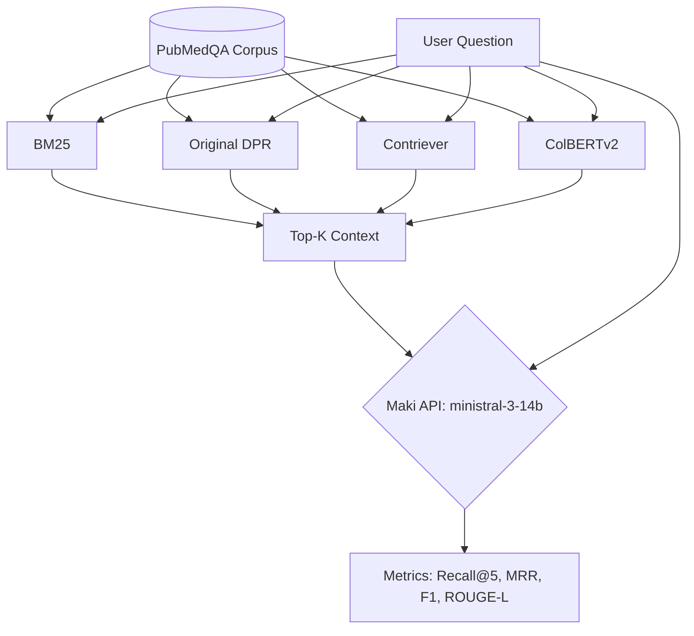

# Context Matters — Evaluating Diversity-Aware Retrieval for RAG

**Team Project**  
University of Mannheim | Chair of Data Science

**MedRAG** is the working name for the medical Retrieval-Augmented Generation pipeline developed for this evaluation.

## Problem Statement

Retrieval quality dictates RAG system performance. This project establishes a rigorous evaluation framework to compare the effectiveness of diverse retrieval architectures (sparse, dense, late-interaction) specifically within the biomedical domain using the PubMedQA dataset.

## Evaluation Flow



## Overview

This is the final Phase 1 (Sprint 1) baseline RAG system for medical question answering using PubMedQA. It evaluates 4 interchangeable retrievers (BM25, Original DPR, Contriever, ColBERTv2) with a fixed cloud-based LLM generator.

> **Note:** The old local Ollama/Gemma pipeline is now obsolete and superseded by the Mannheim Maki API for consistency across experiments.

## Final Sprint 1 Setup

- **Dataset**: PubMedQA-derived corpus
- **Corpus size**: 3,358 documents
- **Questions**: 1,000
- **Retrievers**: BM25, Original DPR, Contriever, ColBERTv2
- **Fixed generator**: Mannheim Maki API
- **Model**: ministral-3-14b
- **Temperature**: 0.0
- **Max tokens**: 512
- **Top-k**: 5

## Final Results Table (Top-5)

| Rank | Retriever | Recall@5 | MRR | F1 | ROUGE-L |
|------|-----------|----------|-----|----|---------|
| 1 | **ColBERTv2** | 0.750586 | 0.979450 | 0.233563 | 0.154260 |
| 2 | **Contriever** | 0.605600 | 0.952733 | 0.229693 | 0.154214 |
| 3 | **BM25** | 0.599211 | 0.911517 | 0.224442 | 0.151232 |
| 4 | **Original DPR** | 0.267880 | 0.474600 | 0.168862 | 0.116195 |

## Interpretation

- **ColBERTv2** is the strongest Sprint 1 baseline retriever.
- **Original DPR** performs weakest, plausibly because it is trained mainly for open-domain QA and is not biomedical-domain adapted.
- **Exact Match** is 0.0 for all retrievers and is not useful for long-form generated medical answers.
- **F1 and ROUGE-L** are weak lexical indicators.
- **Sprint 2** should add MMR, clustering, DPP, faithfulness, hallucination, coverage, and diversity metrics.

## Project Structure

```
medical-rag-project/
├── requirements.txt          # Dependencies
├── src/
│   ├── app.py                    # Streamlit UI
│   ├── config.py                 # Configuration
│   ├── data_prep.py              # PubMedQA download & processing
│   ├── pipeline.py               # RAG pipeline (retriever + generator + eval)
│   ├── generator.py              # Generator config (using Maki API)
│   ├── eval_all_retrievers_safe.py # Safe resumable evaluation script
│   ├── retrievers/
│   │   ├── __init__.py           # BaseRetriever abstract class
│   │   ├── factory.py            # Retriever factory
│   │   ├── bm25_retriever.py     # BM25 (sparse)
│   │   ├── dpr_original_retriever.py # Original Facebook DPR
│   │   ├── dense_retriever.py    # Contriever (dense + FAISS)
│   │   └── colbert_retriever.py  # ColBERTv2 (late interaction)
│   └── evaluation/
│       └── __init__.py           # Metrics (EM, F1, ROUGE-L, Recall@K, MRR)
├── data/
│   ├── corpus.json           # (generated) retrieval corpus
│   ├── qa_pairs.json         # (generated) QA evaluation pairs
│   ├── indices/              # (generated) retriever indices
│   └── embeddings/           # (generated) precomputed embeddings
└── results/                  # Final evaluation CSVs
```

## Installation & Reproducibility

Dependencies are listed in `requirements.txt`. Note that executing the full evaluation pipeline requires an active key for the Mannheim Maki API.

```bash
pip install -r requirements.txt
```

## Precomputed Results

To inspect the findings without executing the pipeline or requiring API credentials, all final outputs are preserved in the `results/` directory.

## Limitations

- **Sprint 1 Focus:** The current iteration only implements basic retrieval metrics.
- **Biomedical Specificity:** Certain general-domain retrievers (like Original DPR) underperform here; results do not necessarily generalize to open-domain QA.

## Medical Disclaimer

This project is for academic research and evaluation of retrieval systems only. It is not intended to provide medical advice, diagnosis, or treatment.

## References

- Jin, Q., et al. (2019). PubMedQA: A Dataset for Biomedical Research Question Answering. EMNLP 2019.
- Karpukhin, V., et al. (2020). Dense Passage Retrieval for Open-Domain QA. EMNLP 2020.
- Izacard, G., & Grave, E. (2022). Contriever. TMLR 2022.
- Khattab, O., & Zaharia, M. (2020). ColBERT. SIGIR 2020.
- Lewis, P., et al. (2020). Retrieval-Augmented Generation. NeurIPS 2020.
